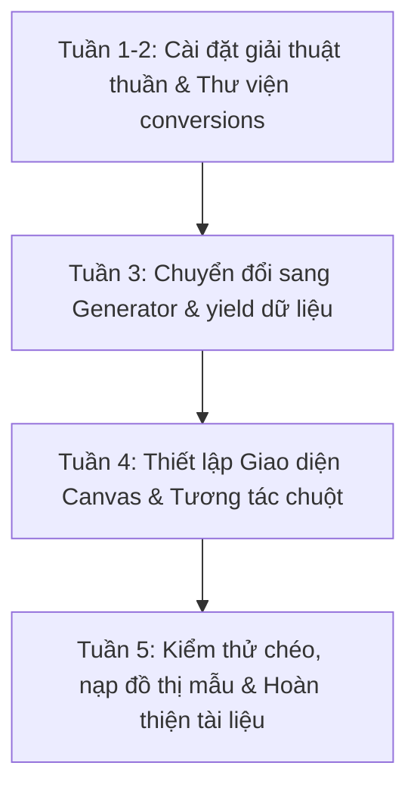

# BÁO CÁO PHÂN TÍCH GIẢI THUẬT & HƯỚNG DẪN TRIỂN KHAI CHI TIẾT
## ĐỀ TÀI: HỆ THỐNG TRỰC QUAN HÓA CẤU TRÚC RỜI RẠC VÀ GIẢI THUẬT ĐỒ THỊ

---

## 📑 MỤC LỤC
1. **MỞ ĐẦU & TỔNG QUAN HỆ THỐNG**
2. **PHÂN TÍCH TOÁN HỌC & GIẢI THUẬT CHI TIẾT**
3. **PHÂN CHIA CÔNG VIỆC CHI TIẾT CHO 5 THÀNH VIÊN (100% THUẬT TOÁN)**
4. **QUY TRÌNH PHỐI HỢP & THỨ TỰ TRIỂN KHAI**
5. **TIÊU CHUẨN HOÀN THÀNH (DEFINITION OF DONE)**

---

## 1. MỞ ĐẦU & TỔNG QUAN HỆ THỐNG

### 1.1. Đặt vấn đề
Lý thuyết đồ thị là một phân ngành cốt lõi trong Cấu trúc rời rạc và Khoa học máy tính. Tuy nhiên, việc giảng dạy lý thuyết đồ thị theo phương pháp truyền thống thường gặp khó khăn do tính trừu tượng của các trạng thái trung gian trong giải thuật (ví dụ: việc nới lỏng cạnh trong Dijkstra, việc nén đường đi trong Kruskal, hay đồ thị dư trong luồng cực đại). 
Hệ thống này được xây dựng nhằm giải quyết bài toán trên bằng cách cung cấp một giao diện trực quan hóa sinh động (Visualizer) giúp người học có thể tương tác vẽ đồ thị tự do, nạp các bài toán mẫu và theo dõi vết chạy giải thuật từng bước một cách trực quan.

### 1.2. Mô hình kiến trúc phần mềm
Hệ thống áp dụng mô hình phân tách mối quan tâm (Separation of Concerns) chia thành 3 lớp chính:
* **Lớp Dữ liệu & Tiện ích (Utils/Data Layer):** Chịu trách nhiệm quản lý cấu trúc đồ thị dạng JSON và thực hiện các phép chuyển đổi biểu diễn đồ thị (Ma trận kề, Danh sách kề, Danh sách cạnh) để phục vụ cho các thuật toán đầu vào khác nhau.
* **Lớp Thuật toán cốt lõi (Core Algorithms - Backend Layer):** Gồm hai phiên bản:
  - *Phiên bản thuần (Pure):* Nằm trong thư mục `algorithms/pure/`, giải thuật chạy tuyến tính và trả về kết quả cuối cùng.
  - *Phiên bản hoạt họa (Generator):* Nằm trong `algorithms/`, sử dụng cơ chế Generator của Python (`yield`) để trả về trạng thái đồ thị tại từng bước lặp, giúp luồng giao diện cập nhật trạng thái đồ thị mà không gây nghẽn luồng chính.
* **Lớp Giao diện & Điều khiển (GUI & Controller Layer):** Viết bằng thư viện `tkinter`, đóng vai trò nhận tương tác từ người dùng (vẽ đỉnh, cạnh, trọng số) và điều phối hoạt họa bằng cách gọi tuần tự generator của thuật toán và vẽ lại (redraw) canvas.

---

## 2. PHÂN TÍCH TOÁN HỌC & GIẢI THUẬT CHI TIẾT

Dưới đây là phân tích toán học, mã khung và độ phức tạp của 9 giải thuật cốt lõi trong dự án:

### 2.1. Duyệt đồ thị (BFS & DFS)
* **BFS (Breadth-First Search):** Xuất phát từ đỉnh $s$, sử dụng cấu trúc dữ liệu Hàng đợi $Q$ (Queue - FIFO). Ở mỗi bước, đỉnh $u$ được lấy ra từ đầu hàng đợi, duyệt qua tất cả các đỉnh lân cận $v$ chưa viếng thăm của $u$, đánh dấu đã viếng thăm và đẩy $v$ vào cuối hàng đợi.
  - *Độ phức tạp:* Thời gian $O(V + E)$, Không gian $O(V)$.
* **DFS (Depth-First Search):** Xuất phát từ đỉnh $s$, thuật toán đi sâu nhất có thể dọc theo mỗi nhánh của đồ thị bằng cách sử dụng cơ chế Stack hoặc đệ quy hệ thống.
  - *Độ phức tạp:* Thời gian $O(V + E)$, Không gian $O(V)$.

### 2.2. Kiểm tra đồ thị hai phía (Bipartite Graph Check)
* **Định nghĩa:** Đồ thị vô hướng $G=(V, E)$ là đồ thị hai phía nếu tồn tại phân hoạch $V = V_1 \cup V_2$ và $V_1 \cap V_2 = \emptyset$ sao cho $\forall (u, v) \in E$, hoặc $u \in V_1, v \in V_2$ hoặc ngược lại.
* **Giải thuật:** Sử dụng giải thuật tô màu đồ thị bằng 2 màu (0 và 1). Khởi tạo màu của tất cả các đỉnh là chưa xác định. Duyệt qua các đỉnh của đồ thị, thực hiện DFS/BFS để tô màu. Nếu đỉnh kề $v$ của $u$ chưa tô màu, tô màu $1 - \text{color}[u]$. Nếu $v$ đã tô màu và $\text{color}[v] == \text{color}[u]$, lập tức dừng thuật toán, truy vết ngược qua mảng cha `parent` để trích xuất **chu trình độ dài lẻ** làm mâu thuẫn minh chứng.
* **Độ phức tạp:** Thời gian $O(V + E)$, Không gian $O(V)$.

### 2.3. Tìm đường đi ngắn nhất (Dijkstra)
* **Nguyên lý:** Kỹ thuật tham lam (Greedy) kết hợp nới lỏng (Relaxation). Duy trì mảng khoảng cách tạm thời $d[v]$ từ đỉnh nguồn $S$. Tại mỗi bước lặp, chọn đỉnh $u$ chưa cố định có $d[u]$ nhỏ nhất, cố định khoảng cách này. Thực hiện nới lỏng với mọi đỉnh kề $v$ chưa cố định của $u$:
  $$\text{Nếu } d[u] + w(u, v) < d[v] \Rightarrow d[v] = d[u] + w(u, v), \text{prev}[v] = u$$
* **Cấu trúc dữ liệu:** Sử dụng Hàng đợi ưu tiên (Min-Heap) để lấy nhanh đỉnh có khoảng cách nhỏ nhất.
* **Độ phức tạp:** Thời gian $O(E \log V)$, Không gian $O(V)$.

### 2.4. Cây khung nhỏ nhất (Kruskal & Prim)
* **Kruskal (Tiếp cận dựa trên cạnh):** Sắp xếp danh sách cạnh theo trọng số tăng dần. Lần lượt duyệt qua các cạnh: nếu hai đỉnh của cạnh nằm ở hai thành phần liên thông khác nhau (sử dụng cấu trúc dữ liệu **Disjoint Set Union - DSU** để kiểm tra), ta kết nạp cạnh đó vào cây khung nhỏ nhất và hợp nhất hai tập hợp. Quá trình dừng khi chọn đủ $V-1$ cạnh.
  - *Độ phức tạp:* Thời gian $O(E \log E)$, Không gian $O(V)$ cho mảng cha của DSU.
* **Prim (Tiếp cận dựa trên đỉnh):** Khởi đầu từ một đỉnh bất kỳ, liên tục duy trì hàng đợi ưu tiên chứa các cạnh nối từ tập đỉnh đã nằm trong cây khung ra ngoài. Chọn cạnh có trọng số nhỏ nhất, đưa đỉnh mới vào cây và đẩy các cạnh kề của đỉnh mới vào Heap.
  - *Độ phức tạp:* Thời gian $O(E \log V)$, Không gian $O(V)$.

### 2.5. Luồng cực đại Ford-Fulkerson (Edmonds-Karp)
* **Nguyên lý:** Tìm đường tăng luồng (Augmenting Path) từ nguồn $s$ đến đích $t$ trên đồ thị dư $G_f$ bằng thuật toán **BFS**. Tìm dung lượng dư nhỏ nhất trên đường đi đó ($\Delta f = \text{bottleneck}$). Cập nhật luồng trên mạng thực tế: tăng luồng theo chiều xuôi thêm $\Delta f$ và giảm luồng theo chiều ngược thêm $\Delta f$ trên đồ thị dư. Thuật toán dừng khi không còn đường đi từ $s$ đến $t$ trên đồ thị dư.
* **Độ phức tạp:** Thời gian $O(V E^2)$ (độc lập với giá trị luồng cực đại).

### 2.6. Chu trình Euler (Fleury & Hierholzer)
* **Định lý:** Đồ thị vô hướng liên thông có chu trình Euler khi và chỉ khi mọi đỉnh của nó đều có bậc chẵn.
* **Giải thuật Fleury:** Chọn một đỉnh bất kỳ làm điểm xuất phát. Khi di chuyển qua các cạnh, ta ưu tiên chọn các cạnh không phải là **cạnh cầu** (cạnh mà nếu xóa đi sẽ làm tăng số thành phần liên thông). Chỉ chọn cạnh cầu khi không còn lựa chọn nào khác.
  - *Độ phức tạp:* Thời gian $O(E^2)$ do mỗi lần chọn cạnh phải chạy DFS để kiểm tra tính chất cầu.
* **Giải thuật Hierholzer:** Hoạt động bằng cách lồng ghép các chu trình con. Đi tự do trên đồ thị cho đến khi quay về điểm xuất phát tạo thành một chu trình đơn, đẩy đường đi vào một Ngăn xếp (Stack). Nếu trên đường đi có các đỉnh vẫn còn cạnh chưa duyệt, ta thực hiện tìm chu trình con từ đỉnh đó và lồng ghép ngược lại vào đường đi ban đầu thông qua thao tác pop Stack.
  - *Độ phức tạp:* Thời gian $O(E)$, Không gian $O(E)$ cực kỳ tối ưu.

---

## 3. PHÂN CHIA CÔNG VIỆC CHI TIẾT CHO 5 THÀNH VIÊN (100% THUẬT TOÁN)

Mỗi thành viên trong nhóm sẽ chịu trách nhiệm toàn bộ về mặt thuật toán thuần (Backend), thuật toán hoạt họa (Generator) và lập trình điều khiển giao diện (GUI) liên quan đến nhóm của mình.

### 3.1. THÀNH VIÊN 1: Nhóm Duyệt đồ thị & Biểu diễn đồ thị
* **Mục tiêu:** Cài đặt các cơ chế lưu trữ đồ thị và các giải thuật duyệt cơ bản làm tiền đề cho cả nhóm.
* **Mã nguồn cần phát triển:**
  - File tiện ích biểu diễn đồ thị: `utils/conversions.py`
  - File thuật toán duyệt: `algorithms/pure/traversal.py`, `algorithms/traversal.py`
  - File giao diện: Tích hợp nút bấm và bảng vẽ lại cho BFS/DFS, hiển thị các dạng biểu diễn đồ thị ở khung giao diện phụ.
* **Khung mã nguồn phải triển khai:**
```python
# utils/conversions.py
def to_adjacency_matrix(nodes, edges, is_directed=False):
    # nodes: list tọa độ [(x, y), ...]
    # edges: list cạnh [(u, v, weight), ...]
    # Trả về ma trận kề dạng mảng 2 chiều
    n = len(nodes)
    matrix = [[0] * n for _ in range(n)]
    for u, v, w in edges:
        matrix[u][v] = w
        if not is_directed:
            matrix[v][u] = w
    return matrix

def to_adjacency_list(nodes, edges, is_directed=False):
    # Trả về danh sách kề dạng dict {u: [(v, w), ...]}
    adj_list = {i: [] for i in range(len(nodes))}
    for u, v, w in edges:
        adj_list[u].append((v, w))
        if not is_directed:
            adj_list[v].append((u, w))
    return adj_list
```
```python
# algorithms/pure/traversal.py
from collections import deque

def bfs(graph, start):
    # graph: adjacency list
    # Trả về: (visited_nodes, traversal_edges)
    visited = []
    visited_set = {start}
    queue = deque([start])
    traversal_edges = []
    
    while queue:
        u = queue.popleft()
        visited.append(u)
        # Sắp xếp theo nhãn tăng dần để đảm bảo kết quả deterministic
        for v, w in sorted(graph.get(u, []), key=lambda x: x[0]):
            if v not in visited_set:
                visited_set.add(v)
                queue.append(v)
                traversal_edges.append((u, v, w))
    return visited, traversal_edges
```
* **Cách thức trực quan hóa trên GUI:**
  - Khi chạy hoạt họa BFS, đỉnh đang được xét đổi thành màu xanh lá cây đậm. Các đỉnh đang nằm chờ trong Hàng đợi (Queue) sẽ được hiển thị danh sách trên bảng log bên cạnh.

---

### 3.2. THÀNH VIÊN 2: Nhóm Đường đi ngắn nhất & Đồ thị hai phía
* **Mục tiêu:** Cài đặt các thuật toán nới lỏng khoảng cách và thuật toán phân hoạch/tô màu đồ thị.
* **Mã nguồn cần phát triển:**
  - File thuật toán: `algorithms/pure/dijkstra.py`, `algorithms/pure/bipartite.py`, `algorithms/dijkstra.py`, `algorithms/bipartite.py`
  - File giao diện: Tích hợp trực quan hóa đường đi Dijkstra (vẽ đường đi màu đỏ đậm) và tô màu 2 phân hoạch của đồ thị hai phía (tô đỉnh màu hồng/xanh da trời).
* **Khung mã nguồn phải triển khai:**
```python
# algorithms/pure/dijkstra.py
import heapq

def dijkstra(graph, start):
    # Trả về dist (dict khoảng cách ngắn nhất), prev (dict vết đường đi)
    dist = {node: float('inf') for node in graph}
    prev = {node: None for node in graph}
    dist[start] = 0
    pq = [(0, start)] # Heap chứa (độ_dài_tạm_thời, đỉnh)
    
    while pq:
        current_dist, u = heapq.heappop(pq)
        if current_dist > dist[u]:
            continue
        for v, weight in graph.get(u, []):
            if weight < 0:
                raise ValueError("Dijkstra không hỗ trợ trọng số âm!")
            if dist[u] + weight < dist[v]:
                dist[v] = dist[u] + weight
                prev[v] = u
                heapq.heappush(pq, (dist[v], v))
    return dist, prev
```
```python
# algorithms/pure/bipartite.py
def check_bipartite(graph):
    # Trả về (True, color_dict) hoặc (False, odd_cycle_list)
    color = {}
    parent = {}
    
    for start_node in graph:
        if start_node not in color:
            stack = [(start_node, 0)]
            color[start_node] = 0
            while stack:
                u, c = stack[-1]
                unvisited_found = False
                for v, _ in graph.get(u, []):
                    if v not in color:
                        color[v] = 1 - c
                        parent[v] = u
                        stack.append((v, 1 - c))
                        unvisited_found = True
                        break
                    elif color[v] == color[u]:
                        # Tìm thấy chu trình lẻ gây xung đột màu
                        cycle = [v, u]
                        curr = u
                        while curr in parent and curr != v:
                            curr = parent[curr]
                            cycle.append(curr)
                        return False, cycle[::-1]
                if not unvisited_found:
                    stack.pop()
    return True, color
```
* **Cách thức trực quan hóa trên GUI:**
  - Đối với đồ thị 2 phía: Nếu đồ thị thỏa mãn, các đỉnh sẽ được tô đổi màu trực tiếp sang Đỏ và Xanh Lam để thể hiện phân hoạch độc lập. Nếu phát hiện chu trình lẻ, cạnh gây xung đột sẽ đổi màu đỏ nhấp nháy và in danh sách đỉnh của chu trình lẻ làm minh chứng phản ví dụ.

---

### 3.3. THÀNH VIÊN 3: Nhóm Cây khung nhỏ nhất (MST)
* **Mục tiêu:** Cài đặt các thuật toán cây khung trên tập đỉnh và tập cạnh của đồ thị.
* **Mã nguồn cần phát triển:**
  - File thuật toán: `algorithms/pure/prim.py`, `algorithms/pure/kruskal.py`, `algorithms/prim.py`, `algorithms/kruskal.py`
  - File giao diện: Highlight các cạnh thuộc cây khung cực tiểu cuối cùng và in tổng trọng số cây khung ra log.
* **Khung mã nguồn phải triển khai:**
```python
# algorithms/pure/kruskal.py
def kruskal(node_count, edges):
    # edges: list [(u, v, w), ...]
    # Trả về: (mst_edges, total_weight)
    parent = list(range(node_count))
    
    def find(x):
        if parent[x] != x:
            parent[x] = find(parent[x]) # Path compression
        return parent[x]
        
    def union(x, y):
        root_x = find(x)
        root_y = find(y)
        if root_x != root_y:
            parent[root_x] = root_y
            return True
        return False
        
    sorted_edges = sorted(edges, key=lambda e: e[2])
    mst = []
    total_weight = 0
    
    for u, v, w in sorted_edges:
        if union(u, v):
            mst.append((u, v, w))
            total_weight += w
            if len(mst) == node_count - 1:
                break
    return mst, total_weight
```
* **Cách thức trực quan hóa trên GUI:**
  - Hoạt họa Kruskal: Các cạnh được duyệt sẽ đổi màu xanh lá cây nhạt khi thuật toán đang xét nó. Nếu cạnh được chọn (không tạo chu trình), cạnh chuyển thành màu đỏ đậm và cố định. Nếu bị loại bỏ (tạo chu trình), cạnh chuyển thành xám mờ rồi biến mất khỏi danh sách chọn.

---

### 3.4. THÀNH VIÊN 4: Nhóm Luồng cực đại (Max Flow)
* **Mục tiêu:** Cài đặt thuật toán Edmonds-Karp tối ưu hóa cho mạng luồng.
* **Mã nguồn cần phát triển:**
  - File thuật toán: `algorithms/pure/max_flow.py`, `algorithms/max_flow.py`
  - File giao diện: Vẽ tỷ số luồng hiện tại trên dung lượng cạnh (ví dụ `12/16`) trực tiếp lên cạnh đồ thị trên canvas.
* **Khung mã nguồn phải triển khai:**
```python
# algorithms/pure/max_flow.py
from collections import deque

def bfs_augmenting_path(graph, capacity, flow, s, t, parent):
    visited = {s}
    queue = deque([s])
    while queue:
        u = queue.popleft()
        for v in graph[u]:
            residual = capacity[(u, v)] - flow.get((u, v), 0)
            if v not in visited and residual > 0:
                visited.add(v)
                parent[v] = u
                if v == t:
                    return True
                queue.append(v)
    return False

def edmonds_karp(node_count, edges, s, t, is_directed=False):
    # Trả về: (max_flow_val, flow_dict)
    # Xây dựng cấu trúc danh sách kề và dung lượng
    graph = {i: set() for i in range(node_count)}
    capacity = {}
    for u, v, w in edges:
        graph[u].add(v)
        capacity[(u, v)] = capacity.get((u, v), 0) + w
        if not is_directed:
            graph[v].add(u)
            capacity[(v, u)] = capacity.get((v, u), 0) + w
            
    flow = {}
    max_flow_val = 0
    parent = {}
    
    while bfs_augmenting_path(graph, capacity, flow, s, t, parent):
        # Tìm bottleneck (dung lượng dư nhỏ nhất trên đường tăng luồng)
        path_flow = float('inf')
        curr = t
        while curr != s:
            p = parent[curr]
            residual = capacity[(p, curr)] - flow.get((p, curr), 0)
            path_flow = min(path_flow, residual)
            curr = p
            
        # Cập nhật luồng trên đồ thị thực và đồ thị dư
        curr = t
        while curr != s:
            p = parent[curr]
            flow[(p, curr)] = flow.get((p, curr), 0) + path_flow
            flow[(curr, p)] = flow.get((curr, p), 0) - path_flow
            curr = p
        max_flow_val += path_flow
        parent = {}
        
    return max_flow_val, flow
```
* **Cách thức trực quan hóa trên GUI:**
  - Đường tăng luồng tìm thấy ở mỗi bước bằng BFS sẽ được highlight màu đỏ đậm. Nhãn chữ hiển thị trọng số của cạnh sẽ tự động chuyển thành định dạng `Luồng_Thực_Tế / Dung_Lượng` (ví dụ: `15/20`) trên Canvas.

---

### 3.5. THÀNH VIÊN 5: Nhóm Đường đi & Chu trình Euler
* **Mục tiêu:** Cài đặt các thuật toán tìm đường đi khép kín đi qua mọi cạnh của đồ thị đúng một lần.
* **Mã nguồn cần phát triển:**
  - File thuật toán: `algorithms/pure/fleury.py`, `algorithms/pure/hierholzer.py`, `algorithms/fleury.py`, `algorithms/hierholzer.py`
  - File giao diện: Vẽ lộ trình chạy dọc qua các cạnh theo thứ tự thời gian tăng dần, in ra ngăn xếp Stack trong quá trình Hierholzer chạy để minh họa thuật toán.
* **Khung mã nguồn phải triển khai:**
```python
# algorithms/pure/hierholzer.py
def find_eulerian_circuit(graph):
    # Trả về danh sách đỉnh biểu diễn chu trình Euler bằng thuật toán Hierholzer
    # graph: Adjacency list dạng {u: [(v, w), ...]}
    # Khởi tạo ma trận đếm số cạnh khả dụng giữa các đỉnh để xóa dần
    adj = {u: {} for u in graph}
    for u in graph:
        for v, w in graph[u]:
            adj[u][v] = adj[u].get(v, 0) + 1
            
    # Bắt đầu thuật toán Hierholzer
    start_node = next(iter(graph)) # Chọn đỉnh đầu tiên có cạnh
    stack = [start_node]
    path = []
    
    while stack:
        u = stack[-1]
        # Tìm đỉnh kề v còn cạnh chưa đi qua
        neighbors = [v for v in adj[u] if adj[u][v] > 0]
        if neighbors:
            v = neighbors[0]
            # Xóa cạnh (u, v) và (v, u) trên đồ thị vô hướng
            adj[u][v] -= 1
            adj[v][u] -= 1
            stack.append(v)
        else:
            path.append(stack.pop())
            
    return path[::-1]
```
* **Cách thức trực quan hóa trên GUI:**
  - GUI sẽ vẽ một đường đi chạy động dọc theo các cạnh tương ứng với lộ trình Euler. Bảng Stack điều khiển của Hierholzer sẽ được in ra hộp log ở mỗi bước đẩy (`PUSH`) và lấy ra (`POP`) đỉnh để minh họa trực quan cách ghép chu trình.

---

## 4. QUY TRÌNH PHỐI HỢP & THỨ TỰ TRIỂN KHAI (5 TUẦN)

Để dự án tích hợp trơn tru, không xảy ra xung đột khi gộp mã nguồn, nhóm cần tuân thủ quy trình phát triển theo 4 giai đoạn sau:



### Chi tiết các giai đoạn:
1. **Tuần 1 & 2 (Thuật toán thuần):** 
   - Thành viên 1 xây dựng xong `utils/conversions.py`.
   - Cả 5 thành viên cài đặt các giải thuật của mình trong thư mục `algorithms/pure/`. Kiểm thử tính đúng đắn trên CLI bằng cách tự viết hàm `main` nhỏ nạp dữ liệu đồ thị dạng mảng/danh sách kề và in kết quả.
2. **Tuần 3 (Generator & Yield):** 
   - Từng thành viên copy thuật toán của mình ra thư mục `algorithms/` ngoài và sửa đổi cấu trúc bằng cách chèn từ khóa `yield` sau mỗi bước lặp chính. 
   - Định nghĩa các trạng thái yield cụ thể: `"START"`, `"EXAMINE"`, `"STEP"`, `"FINISHED"` để truyền trạng thái về giao diện.
3. **Tuần 4 (GUI & Vẽ đồ thị):** 
   - Thành viên 1 và 4 hoàn thiện module Canvas vẽ đỉnh và cạnh.
   - Các thành viên khác viết hàm handler tương ứng để vẽ trạng thái của giải thuật mình lên Canvas và in nhật ký log.
4. **Tuần 5 (Kiểm thử & Nạp demo):**
   - Thiết kế các bộ dữ liệu đồ thị mẫu (dạng tệp tin cấu hình JSON) phù hợp cho từng thuật toán để tích hợp vào menu `Nap do thi mau` giúp người dùng chạy kiểm thử nhanh.

---

## 5. TIÊU CHUẨN HOÀN THÀNH (DEFINITION OF DONE)

Một tính năng thuật toán được coi là hoàn thành 100% khi đáp ứng các tiêu chuẩn chất lượng học thuật và lập trình sau:

### 5.1. Tiêu chuẩn về giải thuật
* **Tính nhất quán (Deterministic):** Kết quả giải thuật phải trùng khớp tuyệt đối với việc giải bằng tay trên giấy. Để đạt được điều này, danh sách các đỉnh kề của mọi đỉnh **phải được sắp xếp theo nhãn tăng dần** trước khi duyệt.
* **Tối ưu hóa tài nguyên:** Sử dụng Heap cho Dijkstra/Prim và DSU cho Kruskal. Không lạm dụng đệ quy quá sâu để tránh tràn bộ nhớ Stack hệ thống (`RecursionError`).
* **Bẫy lỗi đầu vào:** Phải kiểm tra tính hợp lệ của dữ liệu trước khi chạy thuật toán (đưa ra cảnh báo thân thiện lên màn hình thay vì để ứng dụng crash đột ngột).

### 5.2. Tiêu chuẩn về mã nguồn (Clean Code)
* **Quy chuẩn đặt tên:** Đặt tên hàm, tên biến rõ ràng theo chuẩn PEP 8.
* **Docstring:** Tất cả các hàm phải có docstring giải thích rõ đầu vào (tham số, định dạng dữ liệu) và đầu ra.
* **Tính độc lập:** Mã nguồn thuật toán thuần túy tuyệt đối không chứa các tham chiếu trực tiếp đến các thành phần giao diện (Canvas, Button...) để đảm bảo có thể tái sử dụng mã nguồn cho các dự án chạy trên Console khác.
* **Quản lý phiên bản:** Sử dụng Git để quản lý. Mỗi thành viên làm việc trên một nhánh riêng biệt (ví dụ: `feature/dijkstra`), chỉ thực hiện merge vào nhánh `main` sau khi code chạy ổn định và không có lỗi xung đột.
